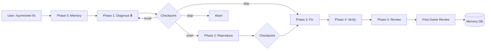

<p align="center">
  <picture>
    <source media="(prefers-color-scheme: dark)" srcset="https://img.shields.io/badge/⚡_Summoner-AI_Orchestration-8b5cf6?style=for-the-badge&&labelColor=2d1b69">
    
  </picture>
</p>

<p align="center">
  <strong>Define AI workflows like Makefile targets.<br>Framework verbs are fixed — project skills are replaceable.</strong>
</p>

<p align="center">
  <a href="https://github.com/johnson-xue/summoner/stargazers"></a>
  <a href="https://github.com/johnson-xue/summoner/blob/master/LICENSE"></a>
  <a href="https://github.com/johnson-xue/summoner/releases/tag/v0.1.0"></a>
  <a href="#"></a>
  <a href="#"></a>
  <a href="#"></a>
</p>

<p align="center">
  <a href="README.md">English</a> ·
  <a href="README_CN.md">中文</a> ·
  <a href="https://johnson-xue.github.io/summoner">Documentation</a> ·
  <a href="https://github.com/johnson-xue/summoner/releases">Releases</a>
</p>

<br>

<details open>
<summary><strong>📖 Table of Contents</strong></summary>

- [🎯 The Problem](#-the-problem)
- [🧩 How It Works](#-how-it-works)
- [🚀 Quick Start](#-quick-start)
- [📋 Commands](#-commands)
- [🏗 Architecture](#-architecture)
- [💻 Platform Support](#-platform-support)
- [💰 Token Cost](#-token-cost)
- [💡 Best Practices](#-best-practices)
- [📁 File Map](#-file-map)
- [📚 Related Projects](#-related-projects)

</details>

---


## 🎯 The Problem

AI coding agents are powerful but **undisciplined**. Without structure:

> ❌ Skipping diagnosis → "The error is obvious, let me fix it"<br>
> ❌ Forgetting reviews → "Looks good, let's merge"<br>
> ❌ Repeating mistakes → "I've seen this bug before but don't remember the fix"<br>
> ❌ Markdown-only instructions → AI may or may not follow them

**Summoner is the process layer that fixes all four.**

| Pain Point | Summoner's Answer |
|:-----------|:------------------|
| 🔍 AI skips diagnosis | **Phase 1 Iron Law** — enforced by hook, not suggestion |
| 🛑 Can't change direction mid-flight | **Checkpoint Protocol** — pause at any phase, recall anytime |
| 🧠 Lessons forgotten next session | **Memory Chain** — SQLite Phase 0 auto-retrieval of past patterns |
| 📋 Reviews only when you remember | **Post-Game Review** — 5-type questionnaire, Stop hook reminder |

<br>

## 🧩 How It Works



**Every phase ends with a checkpoint.** You control when to advance, skip, go back, or stop. No auto-pilot.

<br>

## 🚀 Quick Start

> [!IMPORTANT]
> Requires: **Go** (for hooks) · **SQLite3** (for memory) · **Claude Code** (primary platform)

```bash
# ① Install
git clone https://github.com/johnson-xue/summoner.git ~/.claude/plugins/summoner/
cd ~/.claude/plugins/summoner/hooks && make build

# ② Add to your project
cd your-project
~/.claude/plugins/summoner/scripts/summoner-init.sh

# ③ Initialize memory (optional, recommended)
~/.claude/plugins/summoner/scripts/init-memory-db.sh your-project-name

# ④ Validate
~/.claude/plugins/summoner/scripts/validate-manifest.sh summoner.yaml
```

**That's it.** Restart Claude Code. The SessionStart hook injects Summoner context automatically.

<br>

## 📋 Commands

| Command | 🎯 Pipeline | 💡 Use When |
|:--------|:-----------|:------------|
| `/summoner:fix` | `🔍→🧪→🔧→✅→👀` | Bug fixing — diagnose first, fix after |
| `/summoner:new` | `📝→📊→🏗→🧪→👀` | New features — spec before code |
| `/summoner:ship` | `👀∥🔒∥🧪→📊` | Pre-launch — parallel review + merge decision |
| `/summoner:debug` | `🔍 only` | Quick investigation — just tell me what's wrong |
| `/summoner:ops` | `⚙️ (delegated)` | Server operations — start, stop, restart |
| `/summoner:review` | `👀 only` | Standalone review — no other phases |

> 🔍 diagnose · 🧪 reproduce · 🔧 fix · ✅ verify · 👀 review · 📝 define · 📊 plan · 🏗 implement · 🔒 audit

<br>

## 🏗 Architecture

```
┌──────────────────────────────────────────────────────────┐
│  🏠 Your Project                                         │
│  summoner.yaml → debug→my-skill, test→my-skill           │
├──────────────────────────────────────────────────────────┤
│  ⚡ Summoner Plugin (~/.claude/plugins/summoner/)        │
│                                                          │
│  ┌─────────────────┐  ┌─────────────────┐                │
│  │ 🎮 commands/    │  │ 🧠 skills/      │                │
│  │ /summoner:fix   │  │ summoner/       │                │
│  │ /summoner:new   │  │ SKILL.md        │                │
│  │ /summoner:ship  │  │ routing hub     │                │
│  └─────────────────┘  └─────────────────┘                │
│                                                          │
│  ┌─────────────────┐  ┌─────────────────┐                │
│  │ 🪝 hooks/ (Go)  │  │ 💾 memory/      │                │
│  │ SessionStart    │  │ SQLite db       │                │
│  │ PreToolUse      │  │ Phase 0 search  │                │
│  │ Stop            │  │ Post-game write │                │
│  └─────────────────┘  └─────────────────┘                │
│                                                          │
│  ┌─────────────────┐  ┌─────────────────┐                │
│  │ 🤖 agents/      │  │ 📖 references/  │                │
│  │ code-reviewer   │  │ 7 protocol docs │                │
│  │ security-auditor│  │ + JSON Schema   │                │
│  │ test-engineer   │  │                 │                │
│  └─────────────────┘  └─────────────────┘                │
├──────────────────────────────────────────────────────────┤
│  📦 Existing Skills (unchanged)                          │
│  Superpowers + your project domain skills                │
└──────────────────────────────────────────────────────────┘
```

<br>

## 💻 Platform Support

| Platform | Commands | Memory | Hooks | Personas | Setup |
|:---------|:--------:|:------:|:-----:|:--------:|:-----|
| **Claude Code** | ✅ | ✅ | ✅ | ✅ | `plugin.json` |
| **Gemini CLI** | ✅ | ✅ | — | ✅ | `.gemini/commands/` |
| **OpenCode** | ✅ | ✅ | — | ✅ | `skills/` |
| **Cursor** | ✅ | ✅ | — | — | `.cursor/rules/` |
| **Windsurf** | ✅ | ✅ | — | — | `.windsurfrules` |
| **Copilot** | ✅ | ✅ | — | — | `.github/` |
| **Aider** | ✅ | ✅ | — | — | `CONVENTIONS.md` |
| **Codex** | ⚠️ | ⚠️ | — | — | Prompt |

<details>
<summary><strong>What each tier means</strong></summary>

| Tier | What You Get |
|:------|:------------|
| **Full** (Claude Code) | Slash commands + Go hooks + SQLite Memory + Persona fan-out + Checkpoint enforcement |
| **Standard** (Gemini, OpenCode) | Commands/routing + SQLite Memory (markdown-driven) + Personas |
| **Basic** (Cursor, Windsurf, Copilot, Aider) | Markdown instructions + SQLite Memory (bash-driven) + Checkpoint protocol |

</details>

<br>

## 💰 Token Cost

> [!NOTE]
> **Honest disclosure.** Summoner adds overhead. For single-step tasks, use direct skills.

| Scenario | Tokens | Overhead |
|:---------|:------:|:--------:|
| `/summoner:fix` (bug, memory matched) | ~9,300 | +86% |
| `/summoner:fix` (simple, no memory hit) | ~8,300 | +66% |
| `/summoner:debug` (diagnose only) | ~4,300 | +35% |
| **Direct skill** (baseline) | ~5,000 | — |

> **Rule of thumb:** Multi-step workflows → Summoner. Single-step tasks → direct skill.

<br>

## 💡 Best Practices

<details open>
<summary><strong>📌 Click to expand</strong></summary>

1. 🎯 **Prefer `/summoner:fix` over direct skills.** Phase 0 memory retrieval saves time by loading past patterns before the first diagnostic step.

2. 🔒 **Never skip Phase 1.** Even "obvious" bugs benefit from structured diagnosis. Memory Chain often surfaces non-obvious connections (e.g., "config errors manifest as code errors").

3. 🛑 **Use checkpoints aggressively.** Wrong direction? `recall` is cheaper than undo. Already know the fix? `skip` the reproduce phase. Verbose output? Say "别废话".

4. 📝 **Complete every post-game review.** A 1-minute review feeds the Memory Chain. Next time you hit a similar bug, Phase 0 has your back.

5. 🏷 **Set `project.name` deliberately.** Same name across branches = shared experience. Different name for divergent branches = isolated memory.

6. 🔧 **Rebuild hooks after updates.** `cd hooks && make build` after pulling — Go binaries don't auto-rebuild.

</details>

<br>

## 📁 File Map

<details>
<summary><strong>summoner/ (63 files)</strong></summary>

```
summoner/
├── plugin.json              # Claude Code plugin declaration
├── summoner.md              # Universal entry (any AI tool)
│
├── 🪝 hooks/ (Go)
│   ├── bin/                 # Compiled binaries (make build)
│   ├── shared/              # Common utilities
│   ├── session-start/       # Context injection hook
│   ├── pretooluse-skill/    # State tracking hook
│   ├── stop/                # Review reminder hook
│   └── Makefile
│
├── 🧠 skills/summoner/SKILL.md  # Meta-skill routing hub
├── 🎮 commands/ (6 md)          # Slash command definitions
├── 🤖 agents/ (3 md)            # Reusable personas
├── 📖 references/ (7 md+json)   # Protocol specs + JSON Schema
├── 🔧 scripts/ (3 sh)           # init-db, summoner-init, validate
├── 💾 memory/                   # SQLite databases (runtime)
│
├── 🌐 Platform adapters
│   ├── .gemini/commands/ (6 toml)  # Gemini CLI
│   ├── .opencode/                  # OpenCode
│   └── docs/ (4 setup guides)     # Cursor, Windsurf, Copilot, Aider
│
├── 📚 Documentation
│   ├── README.md / README_CN.md
│   ├── docs/index.html         # GitHub Pages site
│   ├── CHANGELOG.md
│   └── docs/specs/             # Design spec + plan
│
└── 🏛 Community
    ├── CONTRIBUTING.md
    ├── CODE_OF_CONDUCT.md
    └── .github/                # Issue/PR templates + CODEOWNERS
```

</details>

<br>

<p align="center">
  <a href="https://star-history.com/#johnson-xue/summoner&Date">
    
  </a>
</p>

## 📚 Related Projects

| Project | Stars | What It Does |
|:--------|:-----:|:------------|
| [anthropics/skills](https://github.com/anthropics/skills) | ★ | Official Anthropic skill examples |
| [obra/superpowers](https://github.com/obra/superpowers) | 20k+ | General-purpose Claude Code skills |
| [addyosmani/agent-skills](https://github.com/addyosmani/agent-skills) | — | Production-grade engineering skills |
| [claude-mem](https://github.com/yoloshii/ClawMem) | 180+ | Agent memory with hybrid RAG |

<br>

<p align="center">
  <sub>MIT © <a href="https://github.com/johnson-xue">Jingshan Xue</a> · Built with Claude Code · LoL-inspired</sub>
</p>
