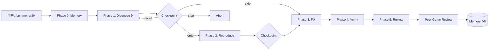

<p align="center">
  <picture>
    <source media="(prefers-color-scheme: dark)" srcset="https://img.shields.io/badge/⚡_Summoner-AI_编排框架-8b5cf6?style=for-the-badge&logo=leagueoflegends&logoColor=white&labelColor=2d1b69">
    
  </picture>
</p>

<p align="center">
  <strong>像 Makefile 定义构建步骤一样定义 AI 工作流。<br>框架动词固定——项目 skill 可替换。</strong>
</p>

<p align="center">
  <a href="https://github.com/johnson-xue/summoner/stargazers"></a>
  <a href="https://github.com/johnson-xue/summoner/blob/master/LICENSE"></a>
  <a href="https://github.com/johnson-xue/summoner/releases/tag/v0.1.0"></a>
  <a href="#"></a>
  <a href="#"></a>
  <a href="#"></a>
</p>

<p align="center">
  <a href="README.md">English</a> ·
  <a href="README_CN.md">中文</a> ·
  <a href="https://johnson-xue.github.io/summoner">文档站点</a> ·
  <a href="https://github.com/johnson-xue/summoner/releases">版本发布</a>
</p>

<br>

<details open>
<summary><strong>📖 目录</strong></summary>

- [✨ 演示](#-演示)
- [🎯 痛点](#-痛点)
- [🧩 工作原理](#-工作原理)
- [🚀 快速开始](#-快速开始)
- [📋 命令速查](#-命令速查)
- [🏗 架构](#-架构)
- [💻 平台支持](#-平台支持)
- [💰 Token 成本](#-token-成本)
- [💡 最佳实践](#-最佳实践)
- [📁 文件结构](#-文件结构)
- [📚 相关项目](#-相关项目)

</details>

---

## ✨ 演示

```console
$ /summoner:fix 线上报错 SC_ErrInnerLogic characterItemCfg 104003018 not found

┌─────────────────────────────────────────────────┐
│  ⚡ SUMMONER — Phase 0: Memory Retrieval        │
│                                                 │
│  📚 匹配到 2 条历史经验                          │
│  🐛 配置关联表断裂     (★★★★★) hits: 3           │
│  ⚡ ok检查必做          (★★★) hits: 5            │
│  [enter] 加载经验  [no] 忽略                    │
└─────────────────────────────────────────────────┘

┌─────────────────────────────────────────────────┐
│  ⚡ SUMMONER — Phase 1/5: 诊断根因              │
│  ✅ character_item_conf.json id=104003018 缺失  │
│  📋 根因: conf/ 关联表断裂，非代码 bug          │
│  [enter] 继续  [skip] 跳过  [recall] 回城       │
└─────────────────────────────────────────────────┘

┌─────────────────────────────────────────────────┐
│  ⚡ SUMMONER — Phase 5/5: 审查                  │
│  ✅ 纯配置补全，建议跳过审查                     │
│  📋 产物: character_item_conf.json +1行          │
└─────────────────────────────────────────────────┘

→ Post-Game Review complete ✓
→ Memory updated: config-chain-break (hits: 4)
```

<br>

## 🎯 痛点

AI coding agent 能力很强，但**缺乏纪律**。没有结构化流程时：

> ❌ 跳过诊断 → "错误很明显，让我直接改"<br>
> ❌ 忘记审查 → "看起来没问题，合并吧"<br>
> ❌ 重复踩坑 → "上次见过这 bug，但不记得怎么修的"<br>
> ❌ 纯 Markdown 指令 → AI 不一定遵守

**Summoner 是解决这四大问题的流程层。**

| 痛点 | Summoner 方案 |
|:-----|:------------|
| 🔍 AI 跳过诊断 | **Phase 1 铁律** — hook 程序化强制，而非"建议" |
| 🛑 中途无法纠正方向 | **Checkpoint 协议** — 每个 Phase 可以暂停、回城 |
| 🧠 上轮经验下轮忘 | **Memory Chain** — SQLite Phase 0 自动检索历史 pattern |
| 📋 审查只在记得时做 | **Post-Game Review** — 5 类复盘问卷，Stop hook 提醒 |

<br>

## 🧩 工作原理



**每个 Phase 结束时都有 checkpoint。** 你可以控制何时前进、跳过、回退或停止。没有自动驾驶。

<br>

## 🚀 快速开始

> [!IMPORTANT]
> 需要：**Go**（编译 hooks）· **SQLite3**（记忆存储）· **Claude Code**（主平台）

```bash
# ① 安装
git clone https://github.com/johnson-xue/summoner.git ~/.claude/plugins/summoner/
cd ~/.claude/plugins/summoner/hooks && make build

# ② 项目接入
cd your-project
~/.claude/plugins/summoner/scripts/summoner-init.sh

# ③ 初始化记忆数据库（推荐）
~/.claude/plugins/summoner/scripts/init-memory-db.sh your-project-name

# ④ 验证配置
~/.claude/plugins/summoner/scripts/validate-manifest.sh summoner.yaml
```

**就这么简单。** 重启 Claude Code，SessionStart hook 会自动注入 Summoner 上下文。

<br>

## 📋 命令速查

| 命令 | 🎯 链路 | 💡 使用场景 |
|:-----|:--------|:----------|
| `/summoner:fix` | `🔍→🧪→🔧→✅→👀` | 修 Bug — 先诊断再修改 |
| `/summoner:new` | `📝→📊→🏗→🧪→👀` | 新功能 — 先规范再编码 |
| `/summoner:ship` | `👀∥🔒∥🧪→📊` | 发版审查 — 并行审查+合并决策 |
| `/summoner:debug` | `🔍 only` | 快速排查 — 只告诉我哪有问题 |
| `/summoner:ops` | `⚙️ (委托)` | 运维操作 — 启动、停止、重启 |
| `/summoner:review` | `👀 only` | 独立审查 — 不经过其他 Phase |

> 🔍 诊断 · 🧪 复现 · 🔧 修复 · ✅ 验证 · 👀 审查 · 📝 定义 · 📊 规划 · 🏗 实现 · 🔒 审计

<br>

## 🏗 架构

```
┌──────────────────────────────────────────────────────────┐
│  🏠 你的项目                                             │
│  summoner.yaml → debug→my-skill, test→my-skill           │
├──────────────────────────────────────────────────────────┤
│  ⚡ Summoner 插件 (~/.claude/plugins/summoner/)          │
│                                                          │
│  ┌─────────────────┐  ┌─────────────────┐                │
│  │ 🎮 commands/    │  │ 🧠 skills/      │                │
│  │ /summoner:fix   │  │ summoner/       │                │
│  │ /summoner:new   │  │ SKILL.md        │                │
│  │ /summoner:ship  │  │ 路由中枢        │                │
│  └─────────────────┘  └─────────────────┘                │
│                                                          │
│  ┌─────────────────┐  ┌─────────────────┐                │
│  │ 🪝 hooks/ (Go)  │  │ 💾 memory/      │                │
│  │ SessionStart    │  │ SQLite db       │                │
│  │ PreToolUse      │  │ Phase 0 检索    │                │
│  │ Stop            │  │ 赛后写入        │                │
│  └─────────────────┘  └─────────────────┘                │
│                                                          │
│  ┌─────────────────┐  ┌─────────────────┐                │
│  │ 🤖 agents/      │  │ 📖 references/  │                │
│  │ code-reviewer   │  │ 7 个协议文档    │                │
│  │ security-auditor│  │ + JSON Schema   │                │
│  │ test-engineer   │  │                 │                │
│  └─────────────────┘  └─────────────────┘                │
├──────────────────────────────────────────────────────────┤
│  📦 现有 Skills（不动）                                  │
│  Superpowers + 你项目的领域 skills                       │
└──────────────────────────────────────────────────────────┘
```

<br>

## 💻 平台支持

| 平台 | 命令 | 记忆 | Hooks | Personas | 接入方式 |
|:-----|:----:|:----:|:-----:|:--------:|:-------|
| **Claude Code** | ✅ | ✅ | ✅ | ✅ | `plugin.json` |
| **Gemini CLI** | ✅ | ✅ | — | ✅ | `.gemini/commands/` |
| **OpenCode** | ✅ | ✅ | — | ✅ | `skills/` |
| **Cursor** | ✅ | ✅ | — | — | `.cursor/rules/` |
| **Windsurf** | ✅ | ✅ | — | — | `.windsurfrules` |
| **Copilot** | ✅ | ✅ | — | — | `.github/` |
| **Aider** | ✅ | ✅ | — | — | `CONVENTIONS.md` |
| **Codex** | ⚠️ | ⚠️ | — | — | 提示词 |

<details>
<summary><strong>各层级说明</strong></summary>

| 层级 | 获得的能力 |
|:-----|:---------|
| **完整**（Claude Code） | 斜杠命令 + Go hooks + SQLite 记忆 + Persona 并行审查 + Checkpoint 程序化约束 |
| **标准**（Gemini, OpenCode） | 命令/路由 + SQLite 记忆（markdown 驱动）+ Personas |
| **基础**（Cursor, Windsurf, Copilot, Aider） | Markdown 指令 + SQLite 记忆（bash 驱动）+ Checkpoint 协议 |

</details>

<br>

## 💰 Token 成本

> [!NOTE]
> **诚实说明。** Summoner 会增加开销。单步骤任务直接使用领域 skill。

| 场景 | Tokens | 额外开销 |
|:-----|:------:|:--------:|
| `/summoner:fix`（有记忆匹配） | ~9,300 | +86% |
| `/summoner:fix`（简单，无记忆匹配） | ~8,300 | +66% |
| `/summoner:debug`（仅诊断） | ~4,300 | +35% |
| **直接 skill**（基准） | ~5,000 | — |

> **经验法则：** 多步骤工作流用 Summoner。单步骤任务直接用领域 skill。

<br>

## 💡 最佳实践

<details open>
<summary><strong>📌 点击展开</strong></summary>

1. 🎯 **优先用 `/summoner:fix` 而非直接调 skill。** Phase 0 记忆检索在诊断前加载历史经验，节省时间。

2. 🔒 **永远不要跳过 Phase 1。** 即使是"显而易见"的 bug 也值得结构化诊断。Memory Chain 经常发现非直觉关联（如"配置错误表现为代码错误"）。

3. 🛑 **善用 checkpoint。** 方向错了？`recall` 回城比撤销代码更便宜。已知怎么修？`skip` 跳过复现阶段。

4. 📝 **每次复盘都做。** 1 分钟复盘喂养 Memory Chain，下次触发类似 bug 时 Phase 0 会自动检索。

5. 🏷 **有意识地设置 `project.name`。** 同一名称跨分支共享经验，不同名称隔离记忆。

6. 🔧 **源码更新后重建 hooks。** `cd hooks && make build` — Go 二进制不会自动重建。

</details>

<br>

## 📁 文件结构

<details>
<summary><strong>summoner/（63 个文件）</strong></summary>

```
summoner/
├── plugin.json              # Claude Code 插件声明
├── summoner.md              # 通用入口（任何 AI 工具）
│
├── 🪝 hooks/ (Go)
│   ├── bin/                 # 编译产物 (make build)
│   ├── shared/              # 公共工具
│   ├── session-start/       # 上下文注入 hook
│   ├── pretooluse-skill/    # 状态追踪 hook
│   ├── stop/                # 复盘提醒 hook
│   └── Makefile
│
├── 🧠 skills/summoner/SKILL.md  # 路由中枢
├── 🎮 commands/ (6 md)          # 斜杠命令定义
├── 🤖 agents/ (3 md)            # 通用 personas
├── 📖 references/ (7 md+json)   # 协议规范 + JSON Schema
├── 🔧 scripts/ (3 sh)           # init-db, summoner-init, 验证
├── 💾 memory/                   # SQLite 数据库（运行时）
│
├── 🌐 平台适配器
│   ├── .gemini/commands/ (6 toml)  # Gemini CLI
│   ├── .opencode/                  # OpenCode
│   └── docs/ (4 个配置指南)        # Cursor, Windsurf, Copilot, Aider
│
├── 📚 文档
│   ├── README.md / README_CN.md
│   ├── docs/index.html         # GitHub Pages 站点
│   ├── CHANGELOG.md
│   └── docs/specs/             # 设计规范 + 计划
│
└── 🏛 社区
    ├── CONTRIBUTING.md
    ├── CODE_OF_CONDUCT.md
    └── .github/                # Issue/PR 模板 + CODEOWNERS
```

</details>

<br>

<p align="center">
  <a href="https://star-history.com/#johnson-xue/summoner&Date">
    
  </a>
</p>

## 📚 相关项目

| 项目 | Stars | 说明 |
|:-----|:-----:|:----|
| [anthropics/skills](https://github.com/anthropics/skills) | ★ | Anthropic 官方 skill 示例 |
| [obra/superpowers](https://github.com/obra/superpowers) | 20k+ | 通用 Claude Code skill 库 |
| [addyosmani/agent-skills](https://github.com/addyosmani/agent-skills) | — | 工程级 skill 合集 |
| [claude-mem](https://github.com/yoloshii/ClawMem) | 180+ | 混合 RAG 智能体记忆 |

<br>

<p align="center">
  <sub>MIT © <a href="https://github.com/johnson-xue">Jingshan Xue</a> · 使用 Claude Code 构建 · 灵感来自英雄联盟</sub>
</p>
